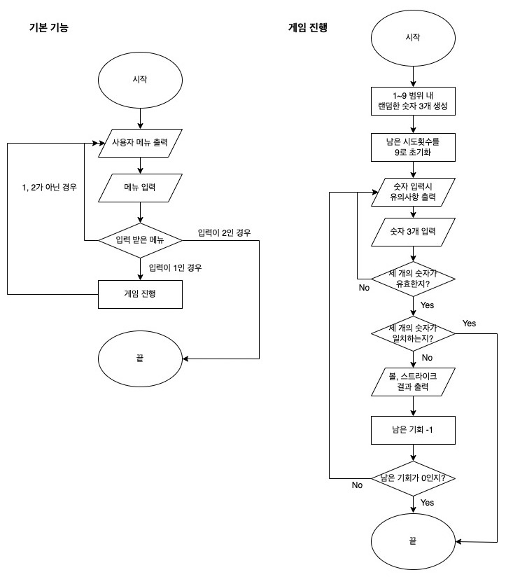
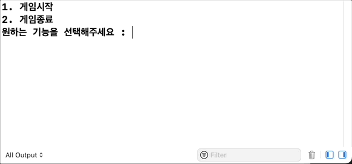
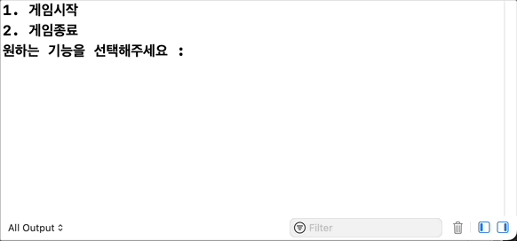

# 숫자야구 게임
> 사용자가 입력한 숫와 임의로 생성한 정수를 비교하는 게임. 총 9번의 기회가 주어지며, 기회 안에 사용자가 세 개의 정수를 맞추면 사용자의 승리.

## 📚 목차
- 팀원소개
- 타임라인
- 순서도
- 실행화면
- 트러블 슈팅
- Reference
- 팀 회고

## 🧑‍💻 팀원 소개
|  |  |
| -------- | -------- |
| **Etialmoon**| **Mary** |

## ⏱️ 타임라인
프로젝트 진행 기간 | 23.04.24.(월) ~ 23.04.28.(금)

| 날짜 | 진행 사항 |
| -------- | -------- |
| 23.04.24.(월)     | 순서도 작성 |
| 23.04.25.(화)     | 랜덤한 정수를 생성하는 함수 추가 볼과 스트라이크 결과를 반환하는 함수 추가 게임시작 함수 추가     |
| 23.04.26.(수)     | 사용자 메뉴 출력 및 입력 받는 함수 추가 게임 숫자를 입력받는 함수 추가 입력받은 게임 메뉴 유효성 검증 입력받은 세 숫자 유효성 검증      |
| 23.04.27.(목)     | 리펙토링 진행     |
| 23.04.28.(금)     | README 작성     |

## ⬇️ 순서도

## 📺 실행화면
- 사용자가 이겼을 때

- 컴퓨터가 이겼을 때

## 🛠️ 트러블 슈팅
1️⃣ **튜플 반환 이용**
🔒 문제점
볼과 스트라이크 결과를 반환하는 함수의 반환타입을 배열로 받으면 index 0번째가 `ball` 인지 `strike`인지 한 눈에 알기 어려웠습니다.

🔑 해결방법
`ball`과 `strike`를 튜플 반환으로 변경하면서 이름을 지정해주니 모호한 표현이 없어지고 코드 가독성이 증가하였습니다.

2️⃣ **기능 분리**
🔒 문제점
`startGame` 함수 안에 3가지 기능이 모두 들어가있어 가독성이 좋지 않았습니다. 
(1) 볼과 스트라이크 결과 및 남은 기회 출력
(2) 3스트라이크인지 확인
(3) 남은 시도 횟수가 0인지 확인

🔑 해결방법
2번과 3번을 각각의 함수로 분리하여 작성하였습니다.

3️⃣ **네이밍**
🤔 고민했던 점
게임 결과를 판정하는 함수 `computeGameResult(computer:, user:)`에서 컴퓨터가 내는 정답을 뜻하는 인자와 유저가 입력하는 답을 뜻하는 인자를 각각
> `correctAnswer`->`winningNubers`
> `userAnswer`->`guessNumbers`
> 
이렇게 변경하고 레이블로 `computer`, `user`를 추가해 누구의 답안인지 구분하도록 했습니다.

이와 같은 식으로 전체 함수와 변수의 네이밍을 고민하는데 가장 많은 시간을 사용했습니다.

4️⃣ **불필요한 import 삭제**
🤔 고민했던 점
전체 파일 안에서 `Foundation`이 필요한 함수가 `components(separatedBy:)`밖에 없었기 때문에 `split(separator:)`로 변경하고 `import`하는 부분을 지웠습니다.

## Reference
- [Functions with Multiple Return Values (튜플)](https://docs.swift.org/swift-book/documentation/the-swift-programming-language/functions/#Functions-with-Multiple-Return-Values)
- [components](https://developer.apple.com/documentation/foundation/nsstring/1413214-components)
- [split](https://developer.apple.com/documentation/swift/string/split(separator:maxsplits:omittingemptysubsequences:))

## 팀 회고
### 우리 팀
👍 특별한 문제 없이 순탄히 진행
👍 오랜시간 높은 집중력

🤔 더 좋은 naming을 작성할 수 있도록 연습

### 팀원 피드백
**[To. Mary]**
덕분에 네임드 튜플이나 shuffled(), compactMap(_:), ~= 같은 함수들도 알게 되고 스텝 조건에 없더라도 기능에 따라 함수를 분리해서 작성하는 모습도 볼 수 있어 많이 배운 것같습니다.

**[To. Etialmoon]**
👍 네비게이터할 때 고민을 오래 하기도 했는데, 재촉하지 않고 기다려주셔서 좋았습니다.
👍 페어프로그래밍 시간 외에도 열심히 공부하시는 모습을 보며 좋은 자극이되었습니다.

